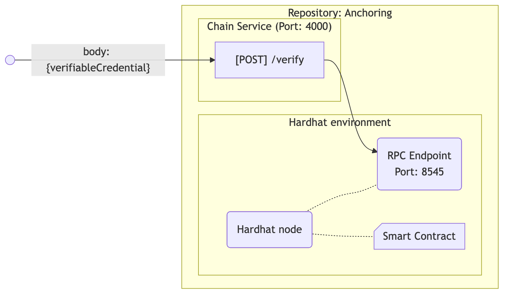

<!-- omit in toc -->
# SecuWeb Anchoring

This repository provides the functionality for storing DID/VC JSON off-chain and storing only hashes on-chain.

- [Overview](#overview)
- [Quick start](#quick-start)
  - [NPM scripts](#npm-scripts)
- [License](#license)

## Overview

Development environment:

- Node v22.10.0
- [Hardhat](https://v2.hardhat.org) (Blockchain development environment)

Main components:

- Hardhat node.
- Smart contract for registering DIDs and anchoring VCs. See the [smart contract](./doc/smart-contract.md) documentation for more details.
- Scripts for interacting with the Hardhat node. See the [scripts](./doc/scripts.md) documentation for more details.
- Verifier Web-service providing REST API for verifying an anchored VC. See the [verifier](./doc/verifier-service.md.md) documentation for more details.



## Quick start

```bash
npm i
#################################################
# Terminal A
#################################################
npx hardhat node            # start Hardhat network

#################################################
# Terminal B
#################################################
npm run deploy             # writes cache/contract.json with address
npm run server             # starts the verifier service
```

> [!NOTE]
> See the [smart contract](./doc/smart-contract.md) documentation for more details.

### NPM scripts

```bash
npm run anchor             # anchor example VC
npm run register           # anchor example DID
npm run resolve            # resolve anchored example DID
npm run check:did          # check and verify example anchored DID
npm run verify:vc          # verify anchored example VC
npm run explore            # create an overview of on-chain data and transactions
```

## License

This code is copyrighted by [Ghent University – imec](http://idlab.ugent.be/)
and released under the [MIT license](http://opensource.org/licenses/MIT).
