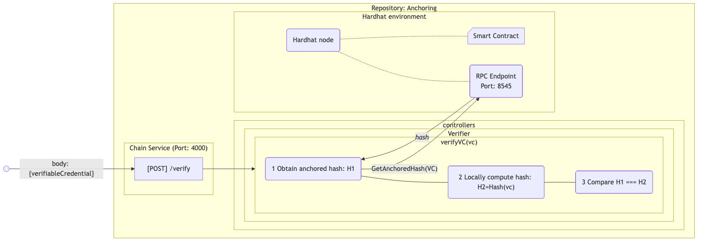

# Verifier Service

The Verifier Web-service exposes a REST API for verifying an anchored objects.

Available routes:

- `POST /verify` verifies a credential payload against the on-chain anchor.
- `GET /explorer` serves a browser-based block explorer for recent blocks and contract activity.
- `GET /explorer/data` returns the explorer snapshot as JSON.

To configure the service's port, see [`config.ts`](../src/config.ts).

